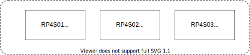

# K3S Infrastructure

|Node name | OS              | HW           |
|----------|-----------------|--------------|
|RP4S01    |Ubuntu 20.04 LTS | RP 4 4GB     |
|RP4S02    |Ubuntu 20.04 LTS | RP 4 8GB     |
|RP4S03    |Ubuntu 20.04 LTS | RP 4 8GB     |

Installed Ubuntu 20.04 LTS  
<https://help.ubuntu.com>  

`sudo apt-get update`  
`sudo apt-get upgrade`  

## Check HW

`sudo lshw`  

### inxi

`sudo apt-get install inxi`  
`inxi -F`  

## Hostname

### Display

hostnamectl  
`cat /etc/hostname`  

## Install kubernetes cluster

<https://opensource.com/article/20/6/kubernetes-raspberry-pi>

### Additions to instruction

Adding flanel network addon:

`sudo kubectl apply -f https://raw.githubusercontent.com/coreos/flannel/master/Documentation/kube-flannel.yml`

Adding proxy:

`kubectl proxy --port=8080&`

To get:

`sudo curl http://localhost:8080/api/`

### Commands

`kubectl get nodes`  
`kubectl get namespaces`  
`kubectl create namespace kube-verify`  
`kubectl get pods --all-namespaces`
`kubectl get all -n kube-verify`  

### Expose Service

#### LoadBalancer

`kubectl expose deployment kube-verify --type=LoadBalancer --name=my-kube-verify -n kube-verify`  

External IP pending... seems to be a problem

##### NodePort

`kubectl expose deployment kube-verify --type=NodePort --name=my-kube-verify -n kube-verify`

Exposes a port on:

<http://192.168.1.163:32216/>  
<http://rp4s01:32216/>  

## Drain and update nodes

<https://kubernetes.io/docs/tasks/administer-cluster/safely-drain-node/>

Get nodes

`kubectl get nodes`

Drain
`kubectl drain rp4s02 --ignore-daemonsets`

Update
`sudo apt-get update`

Upgrade
`sudo apt-get upgrade -y`

Delete cluster

`sudo kubeadm reset`
