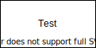

# kubernetes

## Setting up K3S

### OS

<https://www.raspberrypi.org/software/operating-systems/>
<https://ubuntu.com/download/raspberry-pi>

## Setup kubernetes kluster

<https://opensource.com/article/20/6/kubernetes-raspberry-pi>

<https://kubernetes.io>

Learning kubernetes

Kubernetes on github
<https://github.com/kubernetes/kubernetes>

Coursera lab

<https://github.com/googlecodelabs/orchestrate-with-kubernetes>

GKE examples:

`git clone https://github.com/GoogleCloudPlatform/training-data-analyst`

## Local docker desktop

Activate kubernetes, and restart. Had to reset to get it working. Hanged in getting started mode.

## Kubectl

`kubectl config view`

## GKE

`gcloud auth list`

`gcloud config list project`

### Create cluster

```bash
gcloud container clusters create jenkins-cd \
  --num-nodes 2 \
  --machine-type n1-standard-2 \
  --cluster-version latest \
  --zone us-east1-d \
  --service-account "jenkins-sa@$GOOGLE_CLOUD_PROJECT.iam.gserviceaccount.com"
```

### Docs

<https://cloud.google.com/docs>  
<https://cloud.google.com/docs/ci-cd/>
<https://kubernetes.io/>

#### documentation on GKE

<https://cloud.google.com/kubernetes-engine/>


